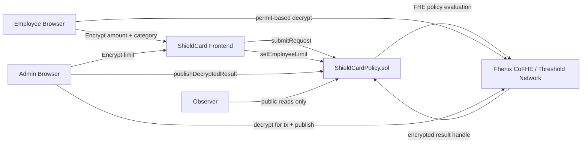
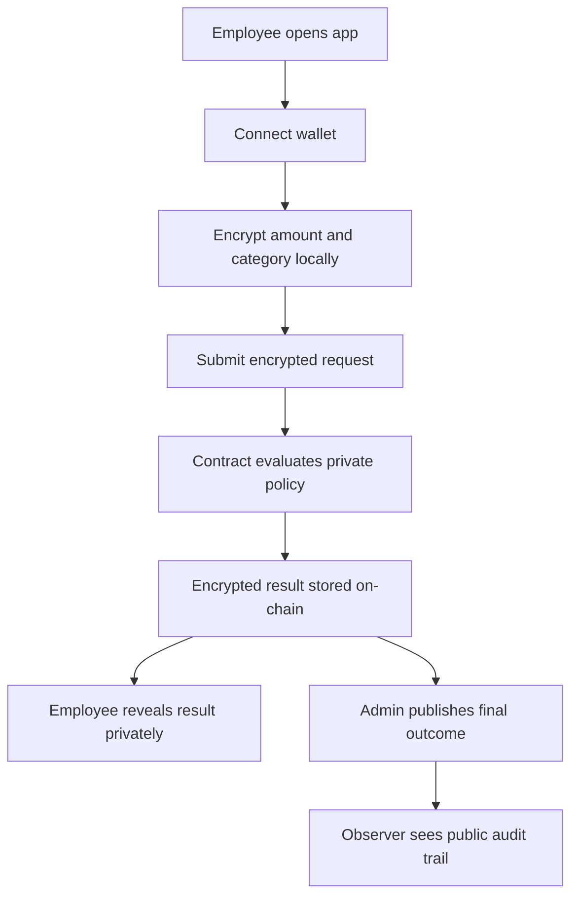
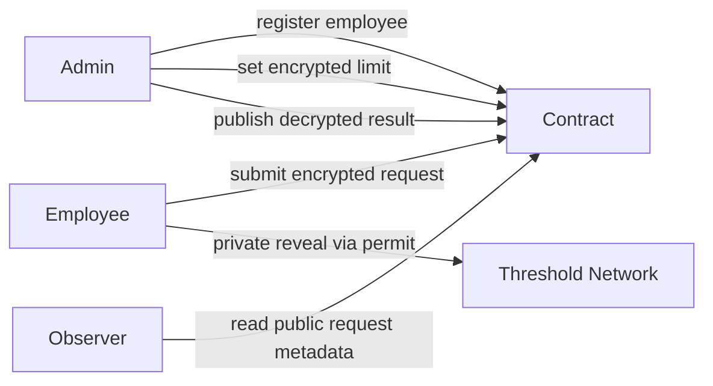
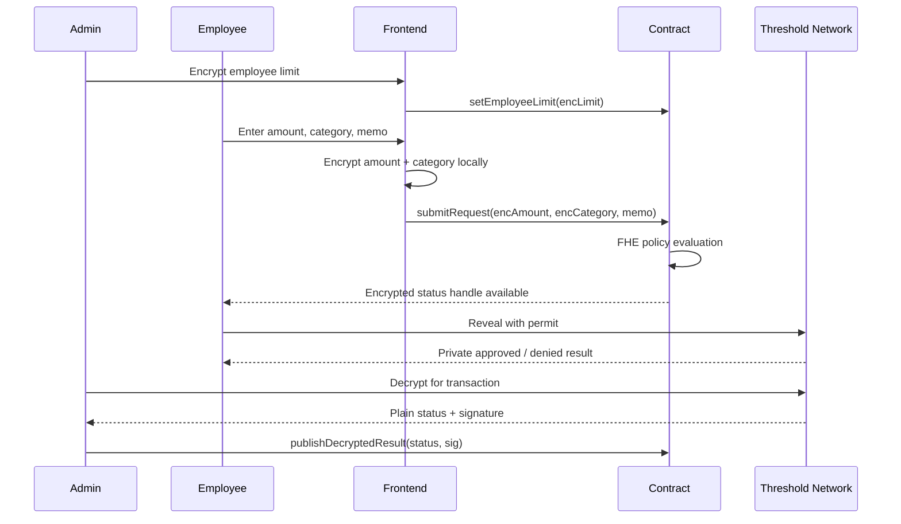

# ShieldCard


ShieldCard is a confidential corporate spend control app built for the Fhenix Buildathon. It demonstrates how a company can enforce spend-policy logic on-chain without exposing employee request amounts, encrypted per-employee limits, or private policy decisions in public state.

Live demo: https://shieldcard-fhenix.netlify.app  
Contract: `0x536b31435bFAE994169181AcA9BAadC784555b4B` on Arbitrum Sepolia  
Explorer: https://sepolia.arbiscan.io/address/0x536b31435bFAE994169181AcA9BAadC784555b4B

## Problem

Most on-chain treasury tools are transparent by default. That is useful for auditability, but it is a poor fit for routine corporate operations where payment amounts, department budgets, category policies, and approval thresholds should not be public.

ShieldCard keeps those inputs encrypted while still allowing the policy engine to evaluate:

- whether a request amount is within an employee's encrypted limit
- whether the request category matches the allowed policy category
- whether the final result should be approved or denied

## What ShieldCard Does

- Admin registers employees on-chain
- Admin stores encrypted employee limits
- Employee encrypts amount and category locally before submission
- Contract evaluates policy privately with FHE operations
- Employee can privately reveal their own result with a permit
- Admin can publish the final plain-text outcome to the public audit trail
- Observer sees only public metadata, ciphertext handles, and published outcomes

## Architecture



## Workflow



## Role Interaction



## Request Lifecycle



## Roles

- `Admin`
  Registers employees, stores encrypted limits, and publishes final outcomes.
- `Employee`
  Submits encrypted requests and privately reveals personal results.
- `Observer`
  Reads public metadata and published outcomes without access to confidential values.

## Repository Layout

```text
contracts/           Solidity contract and interfaces
scripts/             Deploy, seed, verify, and publish scripts
test/                Hardhat + mock CoFHE contract tests
deployments/         Saved deployed addresses by network
frontend/            Next.js app for landing, admin, employee, and observer views
brand-assets/        Project logo and wordmark assets
context.md           Local continuity and release log
```

## Tech Stack

- Solidity `0.8.28`
- Hardhat
- `@fhenixprotocol/cofhe-contracts`
- `@cofhe/sdk`
- Next.js 14 App Router
- React 18
- wagmi + viem
- Netlify static deployment
- Arbitrum Sepolia

## Contract Details

- Network: Arbitrum Sepolia
- Contract: `ShieldCardPolicy`
- Address: `0x536b31435bFAE994169181AcA9BAadC784555b4B`
- Current admin: `0x94c188F8280cA706949CC030F69e42B5544514ac`
- Current registered employees:
  - `0x8df6Dd7B18BD693DD98228D03fEe85424C4293A4`
  - `0x1D7f7354eDA779D15Ebd258aE92F82D9E1b98028`
- Policy model:
  - amount must be less than or equal to the employee's encrypted limit
  - category must equal the allowed category id `1`

## Privacy Model

Publicly visible:

- employee address
- memo
- timestamp
- ciphertext handles
- published final outcome after admin publication

Kept confidential:

- request amount
- request category meaningfully interpreted in policy evaluation
- employee spend limit
- raw decision before reveal/publication
- policy comparison inputs

## Reliability Notes

The frontend was hardened for demo usage with:

- explicit `Open MetaMask`, `submitted`, and `confirming` transaction states
- query invalidation after every write
- lightweight polling for request views
- direct injected-wallet connection flow instead of a broader wallet modal stack
- switch-network recovery controls on admin and employee flows

## Local Setup

### 1. Install dependencies

```bash
pnpm install
cd frontend && pnpm install
```

### 2. Configure environment

Root `.env`:

```bash
cp .env.example .env
```

Frontend `.env.local`:

```bash
cp frontend/.env.example frontend/.env.local
```

Required root env values:

- `PRIVATE_KEY`
- `EMPLOYEE_A_PRIVATE_KEY`
- `EMPLOYEE_B_PRIVATE_KEY`
- `ARB_SEPOLIA_RPC_URL`
- `ARBISCAN_API_KEY`

Required frontend env values:

- `NEXT_PUBLIC_SHIELDCARD_ADDRESS`
- `NEXT_PUBLIC_ARB_SEPOLIA_RPC_URL`

### 3. Run contract checks

```bash
pnpm compile
pnpm test
```

### 4. Run the frontend

```bash
cd frontend
pnpm dev
```

## Scripts

Root:

- `pnpm compile`
- `pnpm test`
- `pnpm arb-sepolia:deploy`
- `pnpm arb-sepolia:seed-demo`
- `pnpm arb-sepolia:publish-results`
- `pnpm arb-sepolia:verify-seed`

Frontend:

- `pnpm lint`
- `pnpm build`
- `pnpm dev`

## Demo Flow

Recommended recording path:

1. Open the landing page and move into `/app`
2. Connect the admin wallet on Arbitrum Sepolia
3. Show employee registration and encrypted limit setup
4. Switch to an employee wallet and submit a request
5. Show the explicit wallet/confirmation states resolving
6. Reveal the result privately as the employee
7. Switch back to the admin wallet and publish the outcome
8. End on `/observer` to show the public audit trail without exposing the confidential inputs

## Limitations

- Single-company demo contract
- Fixed allowed category model in the current MVP
- No real payment rails or settlement integration
- No mobile-first WalletConnect path in the present demo configuration
- Threshold-network latency still exists for publish/reveal flows and must be communicated in UX

## Roadmap

- richer encrypted category policy support
- multi-policy or multi-company configuration
- better result indexing and filtering for admin operations
- audit exports and compliance-oriented observer reporting
- stronger end-to-end browser automation around demo-safe wallet flows
