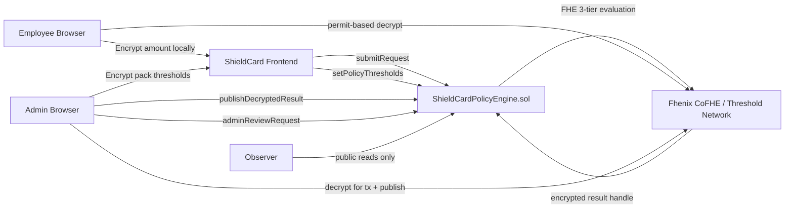
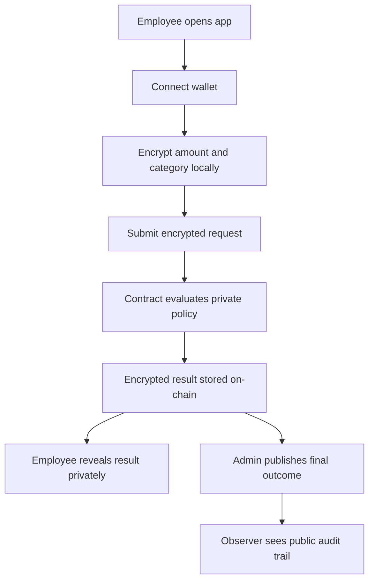
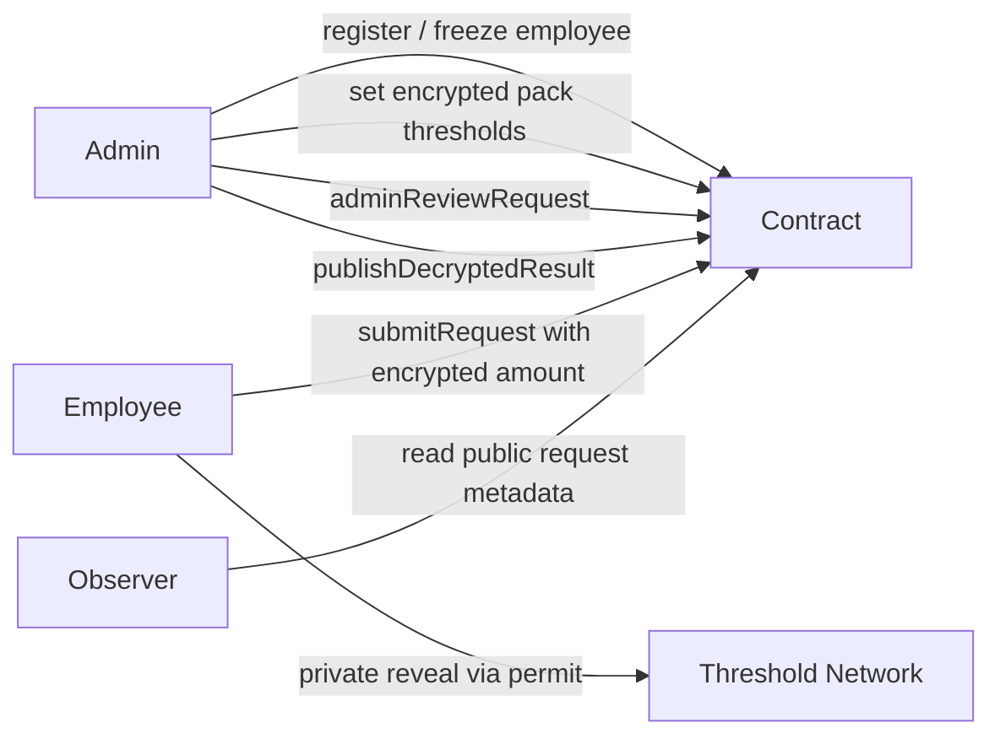
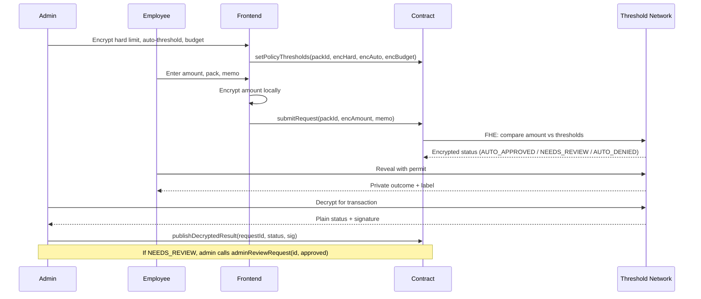

# ShieldCard


ShieldCard is a confidential corporate spend control app built for the Fhenix Buildathon. It demonstrates how a company can enforce spend-policy logic on-chain without exposing employee request amounts, encrypted per-employee limits, or private policy decisions in public state.

Live demo: https://shieldcard-fhenix.netlify.app  
Contract: `0xaa4CDf8ad483445eD77e2a3F772e96A2E10ACC5a` on Arbitrum Sepolia  
Explorer: https://sepolia.arbiscan.io/address/0xaa4CDf8ad483445eD77e2a3F772e96A2E10ACC5a

## Problem

Most on-chain treasury tools are transparent by default. That is useful for auditability, but it is a poor fit for routine corporate operations where payment amounts, department budgets, category policies, and approval thresholds should not be public.

ShieldCard keeps those inputs encrypted while still allowing the policy engine to evaluate:

- whether a request amount is within the encrypted hard limit for its policy pack
- whether the amount falls below the auto-approval threshold or requires admin review
- whether the rolling budget cap for the period has been reached
- what the final outcome should be: auto-approved, auto-denied, or escalated for review

## What ShieldCard Does

- Admin creates policy packs (Travel, SaaS, Vendor, Marketing) with encrypted thresholds
- Admin registers employees and can freeze or unfreeze individual accounts
- Employee encrypts their spend amount locally and submits to a policy pack
- Contract evaluates the policy privately using FHE: auto-approves, auto-denies, or escalates to admin review
- Employee can privately reveal their own outcome using a permit-based decrypt
- Admin resolves review-queue items and publishes final outcomes with settlement receipts
- Observer sees only public metadata, ciphertext handles, and published outcomes — amounts and thresholds remain sealed

## Architecture



## Workflow



## Role Interaction



## Request Lifecycle



## Roles

- `Admin`
  Creates policy packs with encrypted thresholds, registers and manages employees, resolves the review queue, and publishes final outcomes with settlement receipts.
- `Employee`
  Submits encrypted spend requests to a policy pack and privately reveals personal results using a permit.
- `Observer`
  Reads public metadata, ciphertext handles, and published outcomes without access to confidential values.

## Repository Layout

```text
contracts/           Solidity contract and interfaces
scripts/             Deploy, seed, verify, and publish scripts
test/                Hardhat + mock CoFHE contract tests
deployments/         Saved deployed addresses by network
frontend/            Next.js app for landing, admin, employee, and observer views
brand-assets/        Project logo and wordmark assets
context.md           Local continuity and release log
```

## Tech Stack

- Solidity `0.8.28`
- Hardhat
- `@fhenixprotocol/cofhe-contracts`
- `@cofhe/sdk`
- Next.js 14 App Router
- React 18
- wagmi + viem
- Netlify static deployment
- Arbitrum Sepolia

## Contract Details

- Network: Arbitrum Sepolia
- Contract: `ShieldCardPolicyEngine`
- Address: `0xaa4CDf8ad483445eD77e2a3F772e96A2E10ACC5a`
- Explorer: https://sepolia.arbiscan.io/address/0xaa4CDf8ad483445eD77e2a3F772e96A2E10ACC5a
- Current admin: `0x94c188F8280cA706949CC030F69e42B5544514ac`
- Current registered employees:
  - `0x8df6Dd7B18BD693DD98228D03fEe85424C4293A4`
  - `0x1D7f7354eDA779D15Ebd258aE92F82D9E1b98028`
- Policy packs: Travel (1), SaaS (2), Vendor (3), Marketing (4) — all active with encrypted thresholds
- 3-tier routing:
  - amount ≤ auto-threshold → `AUTO_APPROVED`
  - amount > auto-threshold and ≤ hard limit → `NEEDS_REVIEW` (admin queue)
  - amount > hard limit OR budget cap exhausted → `AUTO_DENIED`
- Settlement receipts: deterministic `keccak256(requestId, status, timestamp)` stored on-chain after publish

## Privacy Model

Publicly visible:

- employee address
- memo
- timestamp
- ciphertext handles (opaque bytes32 — no value inference)
- published final outcome after admin publication
- settlement receipt hash

Kept confidential:

- request amount
- pack hard limit, auto-threshold, rolling budget cap
- raw FHE decision before reveal or publication
- policy comparison inputs and intermediate values

## Reliability Notes

The frontend was hardened for demo usage with:

- explicit `Open MetaMask`, `submitted`, and `confirming` transaction states
- query invalidation after every write
- lightweight polling for request views
- direct injected-wallet connection flow instead of a broader wallet modal stack
- switch-network recovery controls on admin and employee flows

## Local Setup

### 1. Install dependencies

```bash
pnpm install
cd frontend && pnpm install
```

### 2. Configure environment

Root `.env`:

```bash
cp .env.example .env
```

Frontend `.env.local`:

```bash
cp frontend/.env.example frontend/.env.local
```

Required root env values:

- `PRIVATE_KEY`
- `EMPLOYEE_A_PRIVATE_KEY`
- `EMPLOYEE_B_PRIVATE_KEY`
- `ARB_SEPOLIA_RPC_URL`
- `ARBISCAN_API_KEY`

Required frontend env values:

- `NEXT_PUBLIC_SHIELDCARD_ADDRESS`
- `NEXT_PUBLIC_ARB_SEPOLIA_RPC_URL`

### 3. Run contract checks

```bash
pnpm compile
pnpm test
```

### 4. Run the frontend

```bash
cd frontend
pnpm dev
```

## Scripts

Root:

- `pnpm compile`
- `pnpm test`
- `pnpm arb-sepolia:deploy`
- `pnpm arb-sepolia:seed-demo`
- `pnpm arb-sepolia:publish-results`
- `pnpm arb-sepolia:verify-seed`

Frontend:

- `pnpm lint`
- `pnpm build`
- `pnpm dev`

## Demo Flow

Recommended recording path:

1. Open the landing page and move into `/app`
2. Connect the admin wallet on Arbitrum Sepolia
3. Show policy pack manager: active packs with encrypted thresholds, pack summaries
4. Show employee management: registered employees, freeze/unfreeze controls
5. Show review queue: in-review request with approve/deny actions
6. Switch to an employee wallet and submit a new encrypted request
7. Show the explicit encrypting → awaiting wallet → submitted → confirming states
8. Reveal the result privately as the employee (permit-based decrypt)
9. Show the receipt card and JSON export
10. End on `/observer` to show the public audit trail without exposing confidential inputs

## Limitations

- Single-company demo contract
- No real payment rails or settlement integration
- No mobile-first WalletConnect path in the present demo configuration
- Threshold-network latency exists for publish and reveal flows (communicated in UX with explicit phase labels)
- Budget tracking is per epoch; epoch resets are admin-triggered, not time-based

## Roadmap

- richer encrypted category policy support
- multi-policy or multi-company configuration
- better result indexing and filtering for admin operations
- audit exports and compliance-oriented observer reporting
- stronger end-to-end browser automation around demo-safe wallet flows
