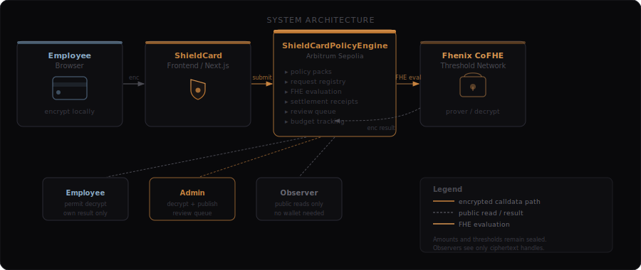
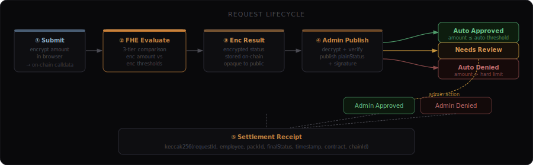
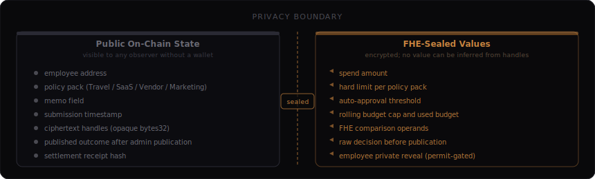

<div align="center">


<br/><br/>

**Confidential corporate spend approvals on-chain — amounts, thresholds, and decisions stay encrypted.**

<br/>

[](https://shieldcard-fhenix.netlify.app)
[](https://sepolia.arbiscan.io/address/0xaa4CDf8ad483445eD77e2a3F772e96A2E10ACC5a)
[](https://sepolia.arbiscan.io)
[](#)
[](./LICENSE)

</div>

---

## Why ShieldCard Exists

Public blockchains expose every transaction detail by default. That works for auditability — but it breaks corporate spend workflows.

When an employee submits a payment request, the amount they're requesting, the policy thresholds governing that request, the department budget remaining, and the outcome of the approval decision are all information that belongs inside a company's trust boundary — not broadcast to any block explorer.

ShieldCard enforces spend-policy logic on-chain without revealing any of those values. The policy engine evaluates encrypted inputs and produces an encrypted decision. The public ledger records that a request was evaluated, not what the numbers were.

Auditability is preserved through published outcomes and deterministic settlement receipt hashes. Privacy is enforced through Fhenix CoFHE fully homomorphic encryption.

---

## What ShieldCard Does

| Capability | Detail |
|---|---|
| **Encrypted request submission** | Employee encrypts spend amount in-browser via CoFHE SDK; only the ciphertext handle is submitted on-chain |
| **Confidential policy packs** | Admin sets encrypted hard limits, auto-approval thresholds, and rolling budget caps per pack |
| **Three-path FHE routing** | Contract evaluates encrypted comparisons and routes to Auto-Approved, Needs Review, or Auto-Denied |
| **Rolling encrypted budget** | Budget accumulator updates homomorphically each submission; exhausted budget triggers Auto-Denied |
| **Admin review queue** | Needs-Review requests surface to admin for manual approve or deny |
| **Employee freeze / unfreeze** | Admin can freeze individual employees; frozen accounts cannot submit requests |
| **Global pause / unpause** | Admin can halt all new submissions without affecting existing requests |
| **Pack activation / deactivation** | Individual policy packs can be toggled active without affecting others |
| **Budget epoch reset** | Admin resets the encrypted rolling budget accumulator to restart a spend period |
| **Private employee reveal** | Employee privately decrypts their own request outcome via Fhenix permit; no admin involvement |
| **Public observer audit trail** | Published outcomes, pack metrics, and receipt hashes are publicly readable without a wallet |
| **Settlement receipt hash** | Deterministic `keccak256` receipt committed on-chain after every finalised request |

---

## Architecture







---

## Core Contract

| Field | Value |
|---|---|
| **Contract** | `ShieldCardPolicyEngine` |
| **Address** | [`0xaa4CDf8ad483445eD77e2a3F772e96A2E10ACC5a`](https://sepolia.arbiscan.io/address/0xaa4CDf8ad483445eD77e2a3F772e96A2E10ACC5a) |
| **Network** | Arbitrum Sepolia (chainId 421614) |
| **Admin** | `0x94c188F8280cA706949CC030F69e42B5544514ac` |
| **Explorer** | https://sepolia.arbiscan.io/address/0xaa4CDf8ad483445eD77e2a3F772e96A2E10ACC5a |

### Policy Packs

| ID | Name | Purpose |
|---|---|---|
| 1 | Travel | Travel expense requests |
| 2 | SaaS | Software subscription payments |
| 3 | Vendor | Vendor and supplier payments |
| 4 | Marketing | Marketing and campaign spend |

All four packs are active with encrypted thresholds and rolling budgets configured.

### Settlement Receipt

Every finalised request receives a deterministic on-chain receipt:

```solidity
receiptHash = keccak256(abi.encodePacked(
    requestId,
    req.employee,
    req.packId,
    finalStatus,
    req.timestamp,
    address(this),
    block.chainid
));
```

The receipt uniquely identifies the outcome without exposing the spend amount.

---

## Confidential Policy Engine

ShieldCard's FHE policy logic runs entirely on encrypted operands. No plaintext amount or threshold value is ever accessible to the contract at evaluation time.

### Three-Tier Routing

```
Tier 1 — Auto-Approved:   amount ≤ autoThreshold  AND  newBudget ≤ budgetLimit
Tier 2 — Needs Review:    amount ≤ hardLimit       AND  newBudget ≤ budgetLimit
                          (implicitly: amount > autoThreshold)
Tier 3 — Auto-Denied:     amount > hardLimit        OR  newBudget > budgetLimit
```

Implemented on-chain as a nested FHE select:

```solidity
euint8 result = FHE.select(autoOk, statusAuto,
                  FHE.select(reviewOk, statusReview, statusDenied));
```

### Request Status Lifecycle

| Code | Status | Meaning |
|---|---|---|
| `0` | Submitted | Initial state; FHE result not yet published |
| `1` | Auto Approved | FHE confirmed amount within auto-threshold and budget |
| `2` | Needs Review | FHE confirmed within hard limit; above auto-threshold; queued for admin |
| `3` | Auto Denied | Amount exceeded hard limit or budget was exhausted |
| `4` | Admin Approved | Admin resolved a Needs-Review request as approved |
| `5` | Admin Denied | Admin resolved a Needs-Review request as denied |

---

## Roles

**Admin** — deploys policy packs with encrypted thresholds, registers and manages employee accounts, resolves the Needs-Review queue, and publishes finalised outcomes with settlement receipts.

**Employee** — submits encrypted spend requests against an active policy pack, then privately decrypts their own outcome using a Fhenix permit. No other party can see the decrypted result through this flow.

**Observer** — reads public request metadata, ciphertext handles, pack metrics, and published outcomes without requiring a wallet. Amounts and thresholds remain sealed.

---

## Wave 3 Update

Wave 3 is the current production release. The following capabilities were shipped:

**Contract — `ShieldCardPolicyEngine`**
- New contract deployed on Arbitrum Sepolia replacing the earlier single-threshold version
- Policy pack architecture: multiple named packs, each with independent encrypted thresholds
- Three encrypted thresholds per pack: hard limit, auto-approval threshold, rolling budget cap
- Rolling encrypted budget accumulator — updates homomorphically on every submission
- Six-state request lifecycle (0–5) as documented above
- Auto-approve / needs-review / auto-deny three-path FHE routing
- Admin review queue with explicit approve and deny actions
- Employee freeze / unfreeze
- Global pause / unpause
- Pack active / inactive toggle
- Budget epoch reset
- Settlement receipt hashes on every finalised request
- 80 Hardhat unit tests covering all contract paths

**Frontend — Next.js 14 App Router**
- Full frontend rebuild around the policy pack model
- Admin workspace: policy pack manager, encrypted threshold controls, pack metrics dashboard, needs-review queue, employee freeze/unfreeze, global pause toggle
- Employee workspace: encrypted request submission with explicit phase labels (encrypting → awaiting wallet → submitted → confirming), per-request lifecycle timeline, private reveal with permit, exportable receipt card
- Observer workspace: public audit surface with pack-level summaries and full request index
- CoFHE SDK aligned to `@cofhe/sdk ^0.5.2`
- Netlify production hardening: static chunk cache headers, chunk reload recovery, explicit transaction states, query invalidation after every write

---

## Security and Privacy Model

### What is encrypted

- **Spend amount** — encrypted in-browser by the employee before submission; the contract receives an `InEuint32` ciphertext handle
- **Hard limit** — set by admin as `euint32`; controls the absolute ceiling for a pack
- **Auto-approval threshold** — set by admin as `euint32`; controls the boundary between auto-approve and needs-review
- **Rolling budget cap** — set by admin as `euint32`; limits cumulative epoch spend per pack
- **Used budget accumulator** — updated homomorphically each submission; never decrypted during normal operation
- **FHE comparison operands** — intermediate `ebool` values; never stored or exposed

### What is public

- Employee wallet address and pack selection
- Memo text (submitted plaintext)
- Submission timestamp
- Ciphertext handles (`bytes32`) — these are opaque identifiers; no value can be inferred from a handle
- Published outcome after admin calls `publishDecryptedResult`
- Settlement receipt hash after finalisation

### What FHE enables

Fhenix CoFHE allows the `ShieldCardPolicyEngine` to perform arithmetic and comparison operations on encrypted integers without decrypting them. The policy evaluation — including budget accumulation and three-tier routing — runs entirely on ciphertext. The Fhenix Threshold Network holds the cryptographic material required for decryption; it performs decryption only when presented with a valid permit or admin signature.

This means the on-chain policy engine enforces spending rules without the contract, block validators, or observers ever having access to the plaintext values those rules operate on.

---

## Tech Stack

| Layer | Technology |
|---|---|
| Smart contracts | Solidity 0.8.28, Hardhat |
| FHE primitives | `@fhenixprotocol/cofhe-contracts ^0.1.3` |
| FHE SDK | `@cofhe/sdk ^0.5.2`, `@cofhe/hardhat-plugin ^0.5.2` |
| Frontend | Next.js 14 (App Router, static export) |
| UI | React 18, Tailwind CSS 4, Framer Motion |
| Wallet | wagmi v2, viem v2 |
| Deployment | Netlify |
| Network | Arbitrum Sepolia |

---

## Repository Layout

```
contracts/           ShieldCardPolicyEngine.sol and interfaces
scripts/             Deploy, seed, publish-results, verify-seed scripts
test/                Hardhat + mock CoFHE contract tests (80 tests)
deployments/         Deployed contract addresses by network
frontend/            Next.js app — landing, admin, employee, observer
brand-assets/        Logo, wordmark, and diagram assets
```

---

## Local Development

### 1. Install dependencies

```bash
pnpm install
cd frontend && pnpm install
```

### 2. Configure environment

Root `.env` (copy from example):

```bash
cp .env.example .env
```

Required root variables:

```
PRIVATE_KEY=
EMPLOYEE_A_PRIVATE_KEY=
EMPLOYEE_B_PRIVATE_KEY=
ARB_SEPOLIA_RPC_URL=
ARBISCAN_API_KEY=
```

Frontend `.env.local`:

```
NEXT_PUBLIC_SHIELDCARD_ADDRESS=0xaa4CDf8ad483445eD77e2a3F772e96A2E10ACC5a
NEXT_PUBLIC_ARB_SEPOLIA_RPC_URL=https://sepolia-rollup.arbitrum.io/rpc
```

### 3. Compile and test

```bash
pnpm compile
pnpm test
```

### 4. Run the frontend

```bash
cd frontend
pnpm dev
```

---

## Scripts

### Root

| Script | Purpose |
|---|---|
| `pnpm compile` | Compile Solidity contracts |
| `pnpm test` | Run all 80 Hardhat tests with gas reporting |
| `pnpm arb-sepolia:deploy` | Deploy `ShieldCardPolicyEngine` to Arbitrum Sepolia |
| `pnpm arb-sepolia:seed-demo` | Register employees, create packs, set encrypted thresholds |
| `pnpm arb-sepolia:publish-results` | Publish FHE-decrypted results for pending requests |
| `pnpm arb-sepolia:verify-seed` | Verify on-chain state matches expected seed data |

### Frontend

| Script | Purpose |
|---|---|
| `pnpm dev` | Start Next.js development server |
| `pnpm build` | Build static export |
| `pnpm lint` | Run ESLint |

---

## Deployment

| Resource | Link |
|---|---|
| Live application | https://shieldcard-fhenix.netlify.app |
| GitHub repository | https://github.com/Vinaystwt/ShieldCard |
| Contract explorer | https://sepolia.arbiscan.io/address/0xaa4CDf8ad483445eD77e2a3F772e96A2E10ACC5a |
| Contract address | `0xaa4CDf8ad483445eD77e2a3F772e96A2E10ACC5a` |
| Network | Arbitrum Sepolia |

---

<div align="center">

<br/><br/>
<sub>Built for the Fhenix Buildathon · Arbitrum Sepolia · MIT License</sub>
</div>
