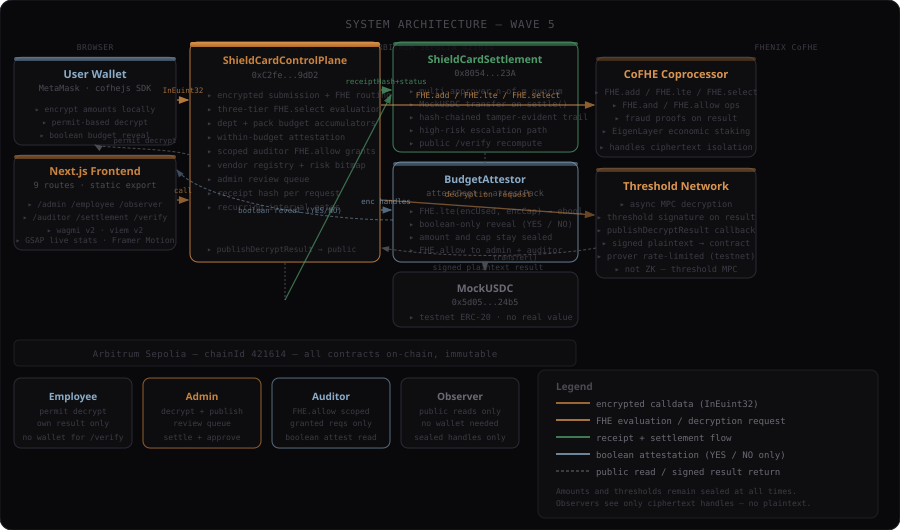
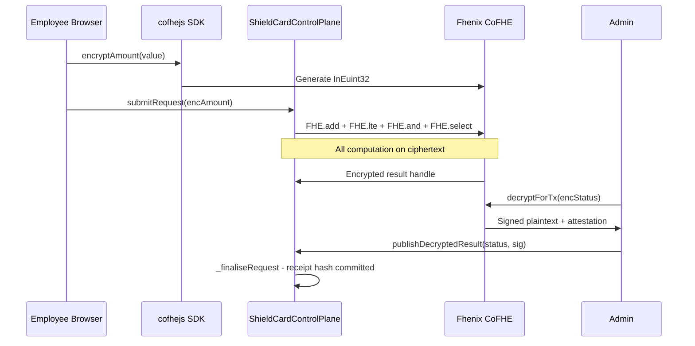
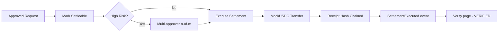
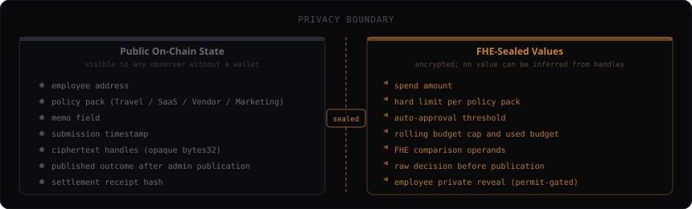
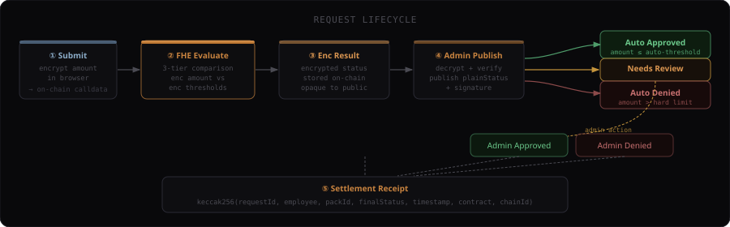

<div align="center">


<br/><br/>

**Confidential Corporate Treasury Control Plane on Fhenix CoFHE**

[Live App](https://shieldcard.xyz) · [Demo Video](https://youtu.be/_Nflr2H00-8) · [Observer View](https://shieldcard.xyz/observer) · [Verify a Receipt](https://shieldcard.xyz/verify?id=0) · [Deploy Your Own](https://shieldcard.xyz/deploy) · [Twitter](https://twitter.com/vinaystwt)

<br/>

[](https://shieldcard.xyz)
[](https://sepolia.arbiscan.io/address/0xC2fe512fE0A4D0Aa0C7452aC43e76aB9331f9dD2)
[](https://sepolia.arbiscan.io)
[](#testing)

</div>

---

ShieldCard enforces corporate spend policy on fully encrypted data using Fhenix CoFHE, settles approved spend as testnet stablecoin transfers, and gives auditors exactly the scoped decryption they are entitled to — nothing more.

---

## Table of Contents

- [The Problem](#the-problem)
- [Why FHE](#why-fhe)
- [What ShieldCard Does](#what-shieldcard-does)
- [Product Screenshots](#product-screenshots)
- [Capabilities](#capabilities)
- [Architecture](#architecture)
- [Privacy Model](#privacy-model)
- [Request Lifecycle](#request-lifecycle)
- [Wave-by-Wave Evolution](#wave-by-wave-evolution)
- [Live Contracts](#live-contracts)
- [Infrastructure](#infrastructure)
- [Local Setup](#local-development)
- [Scripts](#scripts)
- [Testing](#testing)
- [Tech Stack](#tech-stack)
- [Security Architecture](#security-architecture)
- [Built By](#built-by)

---

## The Problem

Corporate spend controls today work like this: employees submit expense requests, managers approve them, and finance reconciles at the end of the month. The problem is that spend thresholds, budget caps, and approval rules are all visible to anyone with database access — creating insider risk, gaming opportunities, and audit exposure.

You cannot enforce a policy rule without the enforcer seeing the values it is being applied to. This is the constraint that FHE breaks.

---

## Why FHE

Fully Homomorphic Encryption allows a contract to evaluate `if amount < threshold` without ever seeing `amount` or `threshold` in plaintext. The policy fires on ciphertext. The result is a ciphertext. Decryption happens only once, only when needed, and only for the party entitled to it.

This means ShieldCard can enforce hard limits and rolling budget caps without the contract, the admin, or any observer ever learning what a specific request amount was — until the admin explicitly calls `publishDecryptResult`.

---

## What ShieldCard Does

ShieldCard is a confidential corporate spend control plane. Three acts:

1. **Encrypt** — employees encrypt spend amounts in-browser via the Fhenix CoFHE SDK; only ciphertext handles enter the contract.
2. **Decide** — the FHE policy engine evaluates encrypted amounts against encrypted thresholds and an encrypted rolling budget. Routes to Auto-Approved / Needs-Review / Auto-Denied without ever decrypting. The Fhenix Threshold Network attests the decision.
3. **Settle and prove** — approved requests move through a multi-approver settlement vault. Testnet MockUSDC transfers on-chain. Every settlement appends to a tamper-evident hash chain. Anyone can verify the audit packet without a wallet.

Confidential computation, public accountability, verifiable settlement trail.

---

## Product Screenshots

<!-- Add screenshots after recording the demo -->
<!-- Suggested paths: brand-assets/screenshots/{landing,observer,admin,auditor,verify}.png -->

---

## Capabilities

| Capability | Uses FHE | Detail |
|---|---|---|
| **Encrypted submission** | ✓ | Employee encrypts amount in-browser via CoFHE SDK. Only ciphertext handle reaches the contract. |
| **Policy packs** | ✓ | Named packs (Travel, SaaS, Vendor, Marketing) with encrypted hard limits, auto-approval thresholds, and rolling budget caps. |
| **Three-tier FHE routing** | ✓ | Nested `FHE.select` over `ebool`. Auto-Approved / Needs-Review / Auto-Denied — computed entirely on ciphertext. |
| **Department budgets** | ✓ | Per-department encrypted budget caps with homomorphic accumulation (`FHE.add`). |
| **Within-budget attestation** | ✓ | `FHE.lte(encUsed, encCap)` → ebool stored per dept/pack. Reveals only boolean; amount and cap stay sealed. |
| **Vendor compliance** | — | Registry with Compliant / Unchecked / Suspended / Banned. Banned vendors hard-revert. |
| **Risk bitmap** | — | 4-bit `uint16` flag per request (vendor status, dept/vendor presence). Public. |
| **Recurring intervals** | — | Per-pack per-employee minimum time between submissions. |
| **Admin review queue** | — | Needs-Review requests surface to admin for manual approve or deny. |
| **Settlement vault** | — | Multi-approver `n-of-m` quorum (separate for high-risk vs normal). MockUSDC payouts. |
| **Hash-chained settlements** | — | `chainHead = keccak256(prev, requestId, recipient, amount, coreReceiptHash, chainId)` — any reorder or tamper breaks continuity. |
| **Scoped auditor disclosure** | ✓ | Admin sets an `auditor` address; `grantAuditorAccess([requestIds])` re-grants encrypted handle access via `FHE.allow` for that batch only. |
| **Admin rotation** | ✓ | `setAdmin` + `grantAdminAccess([requestIds])` for safe ownership rotation with FHE handle re-grants. |
| **Employee private reveal** | ✓ | Employee decrypts own `encAmount` + `encStatus` via FHE permit (wallet-signed permit, no gas). |
| **Public verifier** | — | Wallet-free `/verify` route. Recomputes receipt hash and settlement chain link client-side. Green/red verdict. URL param pre-fill + tamper demo. |
| **Receipt evidence** | — | Employee may attach a `keccak256` receipt hash to a finalised request. |
| **Settlement receipts** | — | Deterministic `keccak256` commitment for every finalised core request. Recomputable from public data. |
| **Live stats bar** | — | GSAP-animated counters: requests / published / settled / on-chain receipts. |
| **Demo guide overlay** | — | 6-step Framer Motion floating guide with per-step route links and keyboard nav. |

> ✓ Computed on encrypted data via Fhenix CoFHE  
> — Plaintext Solidity logic (feature exists; not FHE-encrypted)

---

## Architecture

<div align="center">

</div>

### CoFHE Execution Flow


```mermaid
sequenceDiagram
    participant E as Employee Browser
    participant SDK as cofhejs SDK
    participant C as ShieldCardControlPlane
    participant FHE as Fhenix CoFHE
    participant A as Admin

    E->>SDK: encryptAmount(value)
    SDK->>FHE: Generate InEuint32
    E->>C: submitRequest(encAmount)
    C->>FHE: FHE.add + FHE.lte + FHE.and + FHE.select
    Note over C,FHE: All computation on ciphertext
    FHE->>C: Encrypted result handle
    A->>FHE: decryptForTx(encStatus)
    FHE->>A: Signed plaintext + attestation
    A->>C: publishDecryptedResult(status, sig)
    C->>C: _finaliseRequest - receipt hash committed
```

### Settlement Flow


```mermaid
flowchart LR
    A[Approved Request] --> B[Mark Settleable]
    B --> C{High Risk?}
    C -->|Yes| D[Multi-approver n-of-m]
    C -->|No| E[Execute Settlement]
    D --> E
    E --> F[MockUSDC Transfer]
    F --> G[Receipt Hash Chained]
    G --> H[SettlementExecuted event]
    H --> I[Verify page - VERIFIED]
```

### Three-Tier FHE Routing

```solidity
euint32 newUsed = FHE.add(pack.encUsedBudget, req.encAmount);
ebool withinAutoThresh = FHE.lte(req.encAmount, pack.encAutoThreshold);
ebool withinHardLimit  = FHE.lte(req.encAmount, pack.encHardLimit);
ebool withinBudget     = FHE.lte(newUsed, pack.encBudgetLimit);

ebool autoOk   = FHE.and(withinAutoThresh, withinBudget);
ebool reviewOk = FHE.and(withinHardLimit,  withinBudget);

euint8 result = FHE.select(autoOk, statusAuto,
                  FHE.select(reviewOk, statusReview, statusDenied));
```

No plaintext amount ever touches the EVM. The Fhenix Threshold Network attests the evaluation result via threshold signatures and posts the plaintext `publicStatus` only when admin calls `publishDecryptResult`.

---

## Privacy Model

<div align="center">

</div>

### Encrypted on-chain (FHE handles — CoFHE ACL enforced)

| Field | Who can decrypt |
|---|---|
| `encAmount` | Employee (permit), Auditor (if granted), Admin |
| `encStatus` (pre-publish) | Contract only |
| `encAutoThreshold`, `encHardLimit` | Admin |
| `encBudgetLimit`, `encUsedBudget` (pack) | Admin |
| `encBudgetCap`, `encUsedBudget` (dept) | Admin |
| `ebool withinBudget` (attestation) | Admin + Auditor |

### Public on-chain (plaintext)

Employee address, pack/dept/vendor IDs, memo, timestamp, risk bitmap, ciphertext handles (opaque bytes), published status, receipt hash, evidence hash, all events, settlement state, chain head, recipient address (per settlement), MockUSDC balances.

### What an observer can infer

From `publicStatus = NeedsReview`: amount was greater than auto-threshold and at-or-below hard limit, with budget room.
From `publicStatus = AutoDenied`: amount exceeded hard limit OR budget cap — but cannot distinguish which.

**At no point does the contract or any observer see the plaintext amount or thresholds.**

---

## Request Lifecycle

<div align="center">

</div>

1. **Submit** — Employee encrypts amount in-browser. `submitRequest(encAmount, packId, deptId, vendorId, memo)` stores ciphertext handle + risk bitmap.
2. **Route** — FHE threshold network evaluates three-tier routing on ciphertext. Status written as `encStatus` (sealed).
3. **Publish** — Admin calls `publishDecryptResult(requestId)`. CoFHE decrypts `encStatus` and posts `publicStatus` on-chain. Receipt hash committed.
4. **Review** (if Needs-Review) — Admin manually approves or denies from the review queue.
5. **Settle** — Approver calls `approve(requestId)` on Settlement. Admin calls `settle(requestId)`. MockUSDC transferred. Settlement chain link committed.
6. **Verify** — Anyone calls `/verify?id=N`. Client recomputes receipt hash and settlement chain link from public data. Green/red verdict.

---

## Wave-by-Wave Evolution

ShieldCard was built incrementally across four waves on Fhenix CoFHE. Each wave extended the prior without breaking the prior's invariants.

### Wave 2 — Core FHE Policy Engine

First working contract: encrypted request submission, single-tier auto-approval threshold, basic FHE.lte routing, FHE.allow for employee reveal, receipt hash commitment. No vendor registry or department budgets yet.

- Core: `0x81Ed...5a9D` (Arbitrum Sepolia, superseded)
- Tests: ~40 passing

### Wave 3 — Multi-Tier Routing + Vendor / Dept Registry

Added three-tier `FHE.select` routing (Auto-Approved / Needs-Review / Auto-Denied), per-department encrypted budget caps with `FHE.add` accumulation, vendor compliance registry, 4-bit risk bitmap, recurring submission intervals, and admin review queue.

- Core: `0x268F...` (Arbitrum Sepolia, superseded)
- Tests: ~70 passing

### Wave 4 — Settlement Vault + Auditor Disclosure + Receipt Chain

Deployed `ShieldCardSettlement` alongside core. Multi-approver `n-of-m` quorum, `keccak256` settlement chain link committed on every `settle()`, tamper-evident hash chain verification. Scoped auditor disclosure: `grantAuditorAccess([requestIds])` re-grants encrypted handle ACL via `FHE.allow` per-address. Admin rotation (`setAdmin` + re-grant). Frontend launched: 6 routes, wagmi v2 / viem v2, static Next.js 14 export.

- Core: `0x81Ed...` (Arbitrum Sepolia, superseded)
- Settlement: `0x81c2...` (Arbitrum Sepolia, superseded)
- Tests: ~115 passing

### Wave 5 — Within-Budget Attestation + Full Frontend + 131 Tests

**Current.** New core + settlement redeployed to wire `attestDeptWithinBudget` / `attestPackWithinBudget`: stores `FHE.lte(encUsed, encCap)` ebool on-chain per dept/pack. Reveals only a boolean — amount and cap stay sealed. 12 requests re-seeded, 7 testnet settlements executed, auditor granted on 5 requests, 3 depts + 4 packs attested.

Frontend: settlement write actions (approve + settle) live-wired; auditor side-by-side privacy proof panel; DemoGuideOverlay (6-step Framer Motion guide); GSAP live-stats bar; mobile nav. Named-field request parsing via `parseRawRequest` helper.

- Core: [`0xC2fe512fE0A4D0Aa0C7452aC43e76aB9331f9dD2`](https://sepolia.arbiscan.io/address/0xC2fe512fE0A4D0Aa0C7452aC43e76aB9331f9dD2) — **active**
- Settlement: [`0x8054d6819fa4B43195353579e9519Dd7bc16223A`](https://sepolia.arbiscan.io/address/0x8054d6819fa4B43195353579e9519Dd7bc16223A) — **active**
- Tests: **131 passing**
- Healthcheck: **15/15 PASS**

---

## Live Contracts

### Wave 5 — Active Contracts (Arbitrum Sepolia)

| Contract | Address | Status | Arbiscan |
|---|---|---|---|
| ShieldCardControlPlane | `0xC2fe...9dD2` | 🟢 ACTIVE | [view](https://sepolia.arbiscan.io/address/0xC2fe512fE0A4D0Aa0C7452aC43e76aB9331f9dD2) |
| ShieldCardSettlement | `0x8054...23A` | 🟢 ACTIVE | [view](https://sepolia.arbiscan.io/address/0x8054d6819fa4B43195353579e9519Dd7bc16223A) |
| MockUSDC | `0x5d05...4b5` | 🟢 TESTNET | [view](https://sepolia.arbiscan.io/address/0x5d05BE0586DF41eCF920013f81ae04C2e7a724b5) |

### Historical Contracts

| Contract | Address | Wave | Status |
|---|---|---|---|
| ShieldCardControlPlane | `0x268F...9109` | Wave 4 | 🟡 SUPERSEDED |
| ShieldCardPolicyEngine | `0xaa4C...CC5a` | Wave 3 | 🟡 SUPERSEDED |
| ShieldCardPolicy | `0x536b...55b4B` | Wave 2 | 🟡 SUPERSEDED |

### Live State (Wave 5 seed)

| Metric | Value |
|---|---|
| Requests on-chain | 12 (ids 0–11) |
| Published | 12 |
| Auto-Approved | 7 |
| Auto-Denied | 2 |
| Needs-Review (admin queue) | 3 (ids 1, 5, 11) |
| Testnet settlements | 7 |
| Auditor grants | ids 0, 3, 5, 9, 11 |
| Dept attestations | 3 |
| Pack attestations | 4 |

**Demo verify:** https://shieldcard.xyz/verify?id=0 → green "Receipt verified" + settlement chain verified.

---

## Infrastructure

| Layer | Technology | Purpose |
|---|---|---|
| **Smart Contracts** | Solidity 0.8.28, Fhenix CoFHE 0.1.3 | Policy enforcement, settlement, attestation |
| **FHE Coprocessor** | Fhenix CoFHE + EigenLayer staking | Encrypted computation, threshold decryption |
| **Frontend** | Next.js 14 (static export) | 9 routes, no backend required |
| **Wallet Layer** | wagmi v2, viem v2, RainbowKit | Transaction signing, permit-based decryption |
| **Deployment** | Cloudflare Pages | Global CDN, shieldcard.xyz |
| **Network** | Arbitrum Sepolia (chainId 421614) | EVM-compatible testnet |

### Ecosystem Metrics

| Metric | Value |
|---|---|
| Active contracts | 3 |
| FHE operations in use | `FHE.add`, `FHE.lte`, `FHE.and`, `FHE.select`, `FHE.allow` |
| Frontend routes | 9 |
| Mock tests | 131 |
| Live integration tests | 1 |
| Encrypted state variables | 12 |

---

## Local Development

See [LOCALHOST_SETUP.md](./LOCALHOST_SETUP.md) for the full setup guide including env files, healthcheck, and demo request IDs.

Quick start:

```bash
pnpm install
cd frontend && pnpm install && cd ..
cp .env.example .env          # fill PRIVATE_KEY + ARB_SEPOLIA_RPC_URL
cp frontend/.env.local.example frontend/.env.local
pnpm healthcheck               # 15/15 PASS expected
cd frontend && pnpm dev        # http://localhost:3000
```

---

## Scripts

| Script | Purpose |
|---|---|
| `pnpm compile` | Compile Solidity |
| `pnpm test` | Run all 131 mock CoFHE tests |
| `pnpm healthcheck` | Verify chain state, env, bytecode (15 checks) |
| `pnpm arb-sepolia:deploy` | Deploy ShieldCardControlPlane |
| `pnpm arb-sepolia:deploy-settle` | Deploy MockUSDC + ShieldCardSettlement (idempotent) |
| `pnpm arb-sepolia:seed-demo` | Seed packs/depts/vendors/employees + 12 demo requests |
| `pnpm arb-sepolia:publish-results` | Publish all unpublished requests via CoFHE threshold network |
| `pnpm arb-sepolia:seed-settle` | Fund vault, create + approve + settle approved requests |
| `pnpm arb-sepolia:grant-auditor` | Set demo auditor + grant scoped access on request subset |
| `pnpm arb-sepolia:attest-budgets` | Store `FHE.lte(used, cap)` ebool on-chain for all depts + packs |
| `pnpm arb-sepolia:verify-seed` | Read-only on-chain state dump |
| `RUN_LIVE_INTEGRATION=1 pnpm arb-sepolia:integration-live` | Live end-to-end smoke test |

---

## Testing

**131 passing** across:

| Suite | Tests | Coverage |
|---|---|---|
| `ShieldCardControlPlane.test.ts` | 89 | Pack management, FHE routing, dept/vendor, risk bitmap, publish, admin review, evidence, ACL, receipts |
| `ShieldCardSettlement.test.ts` | 26 | State machine, illegal transitions, multi-approver, hash-chain, receipt recompute, tamper detection, MockUSDC |
| `AuditorRegrant.test.ts` | 6 | FHE.allow re-grant on stored handles, auditor + admin rotation |
| `PhaseA_WithinBudget.test.ts` | 7 | FHE.lte within-budget correctness for dept and pack |
| `PhaseA_CompanionProbe.test.ts` | 3 | Companion probe — FHE.lte callable cross-contract on euint32 handles |

All run against `@cofhe/mock-contracts` via the hardhat plugin. The `integration-live.ts` script provides a real Arbitrum Sepolia round-trip (gated by `RUN_LIVE_INTEGRATION=1`).

---

## Tech Stack

| Layer | Stack |
|---|---|
| Smart contracts | Solidity 0.8.28 + `viaIR` + `evmVersion: cancun` + Hardhat 2.22 |
| FHE primitives | `@fhenixprotocol/cofhe-contracts ^0.1.3` |
| FHE SDK | `@cofhe/sdk ^0.5.2` + `@cofhe/hardhat-plugin ^0.5.2` |
| Token | OpenZeppelin v5 `ERC20` + `SafeERC20` |
| Frontend | Next.js 14 (App Router, static export) |
| Wallet | wagmi v2, viem v2, RainbowKit v2 |
| UI | React 18, Tailwind CSS 4, Framer Motion, GSAP |
| Network | Arbitrum Sepolia (chainId 421614) |

---

## Repository Layout

```
contracts/
  ShieldCardControlPlane.sol         Core (FHE policy, dept/vendor, auditor + admin rotation, within-budget attest)
  ShieldCardSettlement.sol           Settlement vault (multi-approver, hash-chained)
  interfaces/IShieldCardControlPlane.sol
  mocks/
    ShieldCardControlPlaneHarness.sol  test-only internal getter exposure
    MockUSDC.sol                       testnet ERC-20 with faucet
scripts/
  deploy-control-plane.ts            Deploy core
  deploy-settlement.ts               Deploy MockUSDC + Settlement (idempotent)
  seed-control-plane.ts              Seed packs, depts, vendors, employees, 12 demo requests
  publish-results.ts                 Publish all unpublished requests via CoFHE threshold network
  seed-settlement.ts                 Fund vault + create/approve/settle for approved requests
  grant-auditor.ts                   Set auditor + grant scoped access on subset
  attest-budgets.ts                  Store FHE.lte(used, cap) ebool on-chain for all depts + packs
  verify-seed.ts                     Read-only on-chain state dump
  integration-live.ts                RUN_LIVE_INTEGRATION=1 end-to-end smoke test
test/
  ShieldCardControlPlane.test.ts     89 core tests
  ShieldCardSettlement.test.ts       26 settlement tests
  AuditorRegrant.test.ts              6 auditor + admin rotation tests
  PhaseA_WithinBudget.test.ts         7 within-budget attestation tests
  PhaseA_CompanionProbe.test.ts       3 companion probe tests
frontend/
  app/{admin,employee,observer,auditor,settlement,verify,app,page}.tsx
  components/
    landing/    HeroSection, ProblemSection, HowItWorks, ThreeActStrip, ArchitectureSection, CtaStrip, LiveStats
    shell/      TopBar (mobile nav), DemoGuideOverlay (6-step guide)
    brand/      WordMark
  hooks/useShieldCard.ts             Named-field request parsing via parseRawRequest
  lib/contracts.ts                   ABI + address constants
deployments/
  arb-sepolia.json                   Live contract addresses (gitignored — see LOCALHOST_SETUP.md)
brand-assets/
  readme-architecture.svg
  readme-lifecycle.svg
  readme-privacy.svg
  shieldcard-wordmark.svg
  shieldcard-logo.svg
```

---

## Roles

- **Admin** — owner of both contracts; deploys packs, sets thresholds, manages dept/vendor/employee registries, publishes FHE outcomes, resolves Needs-Review queue, creates and settles payouts.
- **Approver** — authorised settlement signer. Quorum `n-of-m` for high-risk, separate for normal-risk.
- **Auditor** — scoped-disclosure role. Receives per-request `encAmount` + `encStatus` access via `FHE.allow` only when admin grants it.
- **Employee** — submits encrypted requests, attaches evidence, privately reveals own outcome via permit.
- **Observer** — wallet-free public read of all on-chain state.
- **Public verifier** — wallet-free recompute-and-compare on `/verify`.

---

## Frontend Routes

| Route | Purpose |
|---|---|
| `/` | Landing — hero, GSAP live stats bar, how-it-works, architecture |
| `/app` | Role gateway — connects wallet, detects role, routes to correct dashboard |
| `/admin` | Admin cockpit — pack/dept/vendor management, publish queue, Needs-Review, risk panel |
| `/employee` | Employee submit + history + private reveal |
| `/observer` | Sealed view — all requests, privacy explainer, no wallet needed |
| `/auditor` | Scoped decryption — side-by-side observer/auditor panel per request |
| `/settlement` | Settlement board — pending/approved/settled, approve + settle write actions |
| `/verify` | **Wallet-free verifier** — recomputes receipt + chain link, green/red verdict, URL param pre-fill |
| `/_not-found` | 404 |

---

## Settlement Receipt Computations

**Core receipt** (committed inside `_finaliseRequest`):
```
receiptHash = keccak256(abi.encodePacked(
  requestId, employee, packId, finalStatus,
  timestamp, contractAddress, chainId
))
```

**Settlement chain link** (committed inside `settle`):
```
chainHead = keccak256(abi.encodePacked(
  prevChainHead, requestId, recipient, amount,
  coreReceiptHash, chainId
))
```

Both are recomputable from public on-chain data. The `/verify` route demonstrates this end-to-end.

---

## Security Architecture

**FHE coprocessor:** ShieldCardControlPlane uses Fhenix CoFHE, a coprocessor model secured by fraud proofs and EigenLayer economic staking. Computation correctness is enforced by the staker network, not zero-knowledge proofs — this is a deliberate design choice that enables stateful encrypted computation across multiple transactions, which ZK circuits do not support natively.

**Threshold decryption:** Encrypted result handles are decrypted by a threshold MPC network that requires a supermajority of key-holders to reconstruct the plaintext. No single party can decrypt without threshold consensus.

**Settlement:** ShieldCardSettlement uses testnet MockUSDC. Settlement amounts represent approved spend authorizations; the system is designed for testnet deployment. Mainnet deployment with real stablecoin rails is the production path.

**Claims:** Every capability described in this README is implemented and verifiable on Arbitrum Sepolia at the contract addresses listed above.

---

## Built By

[Vinay](https://twitter.com/vinaystwt) — builder in the Indian Web3 ecosystem. ShieldCard was built during the Fhenix Privacy-by-Design Buildathon across Waves 2 through 5.

[GitHub](https://github.com/Vinaystwt/ShieldCard) · [Twitter](https://twitter.com/vinaystwt) · [Live App](https://shieldcard.xyz)

---

<div align="center">

<br/><br/>
<sub>Built for the Fhenix Buildathon · FHE-encrypted compute, public accountability · Arbitrum Sepolia · MIT License</sub>
</div>
